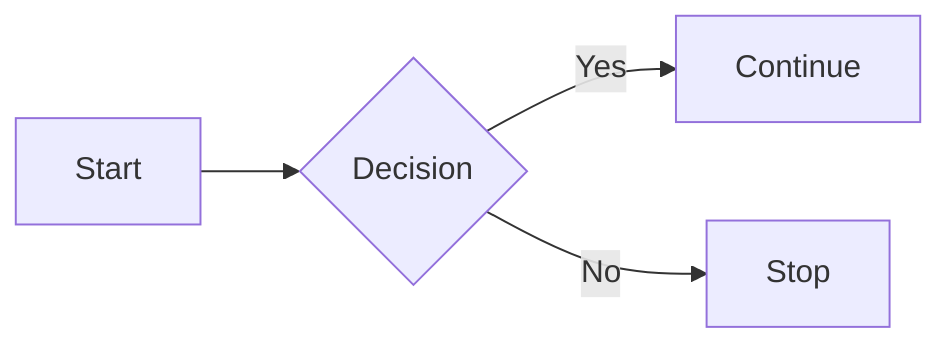

## 1. Обрати предметну систему для проєктування

Необхідно визначити реалістичний приклад інформаційної системи з чітко окресленою метою, предметною областю та очікуваними користувачами (наприклад, система бронювання, обліку, навчання, підтримки клієнтів тощо). Обґрунтувати вибір із позицій актуальності, складності та доцільності автоматизації.

[toc](./index.md)

